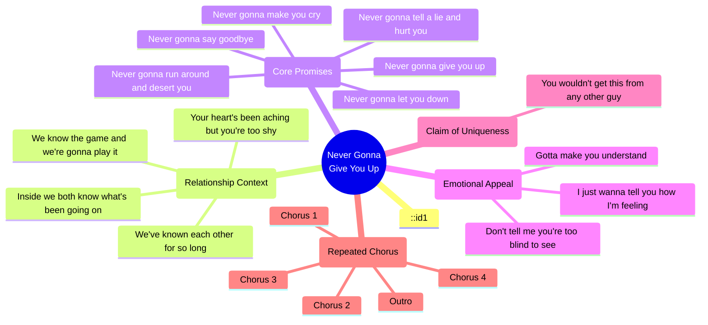

# Never Gonna Give You Up — Rick Astley

```mermaid
mindmap
  root((Never Gonna<br>Give You Up))
    ::id1
    (Relationship Context)
      We've known each other for so long
      Your heart's been aching but you're too shy
      Inside we both know what's been going on
      We know the game and we're gonna play it
    (Core Promises)
      Never gonna give you up
      Never gonna let you down
      Never gonna run around and desert you
      Never gonna make you cry
      Never gonna say goodbye
      Never gonna tell a lie and hurt you
    (Emotional Appeal)
      I just wanna tell you how I'm feeling
      Gotta make you understand
      Don't tell me you're too blind to see
    (Claim of Uniqueness)
      You wouldn't get this from any other guy
    (Repeated Chorus)
      Chorus 1
      Chorus 2
      Chorus 3
      Chorus 4
      Outro
```
